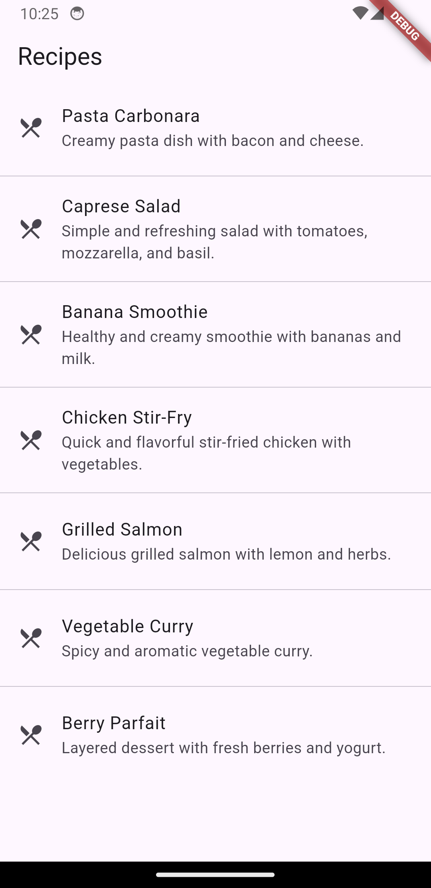
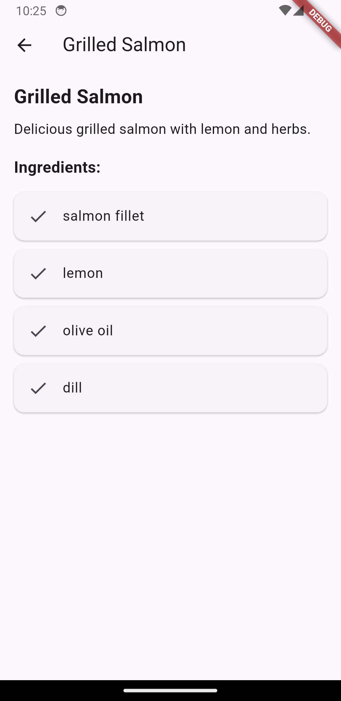

# 🍽️ Recipe App (Flutter)

A simple Flutter application that demonstrates **JSON parsing, data
modeling, navigation, and UI rendering** by displaying a list of recipes
and their details.

------------------------------------------------------------------------

## 📱 Features

-   📄 Parse JSON data into Dart objects
-   🧩 Clean data modeling using a `Recipe` class
-   📋 Display recipes using `ListView.separated`
-   🔍 Navigate to a detailed recipe screen
-   🥗 Show ingredients in a scrollable view
-   🎨 Simple and clean UI using Material Design

------------------------------------------------------------------------

## 🛠️ Tech Stack

-   Flutter
-   Dart
-   Material UI

------------------------------------------------------------------------

## 📂 Project Structure

    lib/
     ├── main.dart
     ├── models/
     │    └── recipe.dart
     ├── data/
     │    └── recipe_data.dart
     ├── screens/
     │    └── recipe_detail_screen.dart

------------------------------------------------------------------------

## 🚀 Getting Started

### 1️⃣ Clone the repository

``` bash
git clone https://github.com/your-username/your-repo-name.git
```

### 2️⃣ Navigate to the project folder

``` bash
cd your-repo-name
```

### 3️⃣ Install dependencies

``` bash
flutter pub get
```

### 4️⃣ Run the app

``` bash
flutter run
```

------------------------------------------------------------------------

## 📦 JSON Data Example

``` json
{
  "recipes": [
    {
      "title": "Pasta Carbonara",
      "description": "Creamy pasta dish with bacon and cheese.",
      "ingredients": ["spaghetti", "bacon", "egg", "cheese"]
    }
  ]
}
```

------------------------------------------------------------------------

## 📸 Screenshots


-   Recipe List Screen
-   Recipe Detail Screen

------------------------------------------------------------------------

## 🎯 Learning Objectives

This project demonstrates:

-   JSON parsing using `dart:convert`
-   Creating model classes in Flutter
-   Using `ListView.separated`
-   Navigation with `Navigator.push()`
-   Building responsive UI layouts

------------------------------------------------------------------------

## 💡 Future Improvements

-   🔍 Add search functionality
-   ❤️ Add favorite recipes feature
-   🌐 Fetch data from an API instead of static JSON
-   🖼️ Add images for recipes

------------------------------------------------------------------------

## 👨‍💻 Author

**Hasan Al Banna**\
GitHub: https://github.com/weeltSchmerz

------------------------------------------------------------------------

## 📄 License

This project is for educational purposes only.
